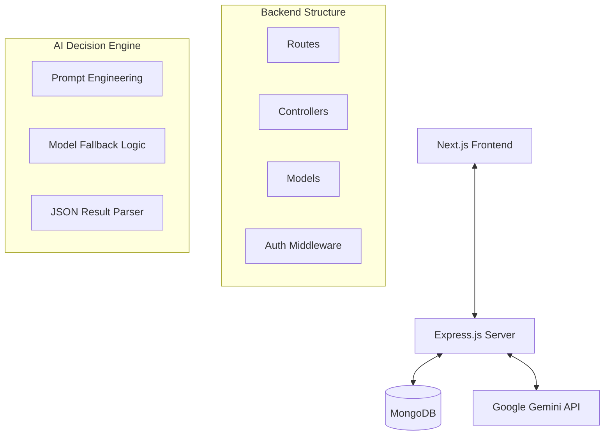

# Umurava AI - AI-Powered Talent Screening Platform

Umurava AI is a cutting-edge recruitment platform designed to streamline the candidate evaluation process using Google Gemini's advanced generative AI models. It automates the screening of resumes against specific job requirements, providing recruiters with an explainable, ranked shortlist of the best talent.

## 🏗️ Architecture

The application follows a modern full-stack architecture built on the MERN stack with complete TypeScript integration.



### Tech Stack
- **Frontend**: Next.js 14+ (App Router), Tailwind CSS, Lucide React, Recharts
- **Backend**: Node.js, Express.js (TypeScript)
- **Database**: MongoDB (Mongoose)
- **Authentication**: JWT with Bear token authentication
- **AI**: Google Generative AI (Gemini API)

## 🚀 Setup Instructions

### Prerequisites
- Node.js (v18+)
- MongoDB (Atlas or local)
- Google Gemini API Key

### 1. Clone the repository
```bash
git clone <repository-url>
cd umurava-ai
```

### 2. Backend Setup
```bash
cd server
npm install
# Create a .env file (see Environment Variables section)
npm run dev
```

### 3. Frontend Setup
```bash
cd client
npm install
# Ensure backend is running at http://localhost:4000
npm run dev
```

## 🔑 Environment Variables

### Backend (`server/.env`)
| Variable | Description | Example |
| :--- | :--- | :--- |
| `PORT` | Server port | `4000` |
| `MONGO_URI` | MongoDB Connection String | `mongodb+srv://...` |
| `JWT_SECRET` | Secret key for JWT signing | `your_super_secret_key` |
| `GEMINI_API_KEY` | Google AI API Key | `AIzaSy...` |
| `NODE_ENV` | Environment mode | `development` |

### Frontend (`client/.env.local`)
| Variable | Description | Example |
| :--- | :--- | :--- |
| `NEXT_PUBLIC_API_URL` | Backend API URL | `http://localhost:4000/api` |

## 🤖 AI Decision Flow

The platform uses a sophisticated AI screening engine to evaluate candidates:

1.  **Data Consolidation**: Fetches the complete job description and all candidate talent profiles associated with the job.
2.  **Context Construction**: Orchestrates a rich, structured prompt that instructs the AI on specific evaluation criteria (Skills 25%, Experience 30%, Education 20%, Projects 15%, Availability 10%).
3.  **Resilient Execution**: Uses a **Model Fallback Logic** to ensure high availability. The engine is configured with a prioritized list of models and automatically retries with the next model if one fails or encounters rate limits:
    ```typescript
    const AVAILABLE_MODELS = [
        'gemini-3.1-flash-lite-preview',
        'gemini-3-flash-preview',
        'gemini-2.5-flash',
        'gemini-2.5-flash-lite',
        'gemini-robotics-er-1.6-preview'
    ] as const;
    ```
4.  **Structured Analysis**: The AI generates a ranked JSON output containing match scores, strengths, gaps, and natural language reasoning for every candidate evaluated.
5.  **Persistence**: Results are saved to the database at the job level for instant retrieval and historical tracking.

## 📁 Candidate Profile Generation & Bulk Parsing

The platform enables seamless candidate ingestion through intelligent document parsing:

1.  **Multi-Format Ingestion**: Supports uploading resumes in **PDF**, **Word (.docx)**, and specialized bulk data in **Excel (.xlsx)**.
2.  **AI-Driven Extraction**: Instead of simple keyword matching, the system uses Gemini to "read" the document and extract structured data:
    *   **Talent Profile Mapping**: Automatically populates 8 core sections including Skills, Experience, Projects, Education, and Certifications.
    *   **Contextual Understanding**: Correctly identifies roles, dates, and technology stacks even in varied resume layouts.
3.  **Batch Processing**: Recruiter can upload dozens of files simultaneously. The system iterates through the files, generates candidate profiles in parallel, and links them to the active job posting.
4.  **Multimodal Support**: Leverages Gemini's ability to process both text-heavy documents and image-based PDF resumes directly.


## 📝 Assumptions and Limitations

### Assumptions
- **Resume Quality**: The system assumes candidates have provided comprehensive data in their profiles.
- **Language**: Current prompts are optimized for English-language resumes and job descriptions.
- **Recruiter Ownership**: The system assumes a 1-to-N relationship where a recruiter owns specific jobs and can only see results for those jobs.

### Limitations
- **Token Limits**: Processing more than 100-300 candidates in a single AI call may exceed context window limits of some smaller models (mitigated by fallback logic).
- **Processing Time**: AI analysis can take 10-60 seconds depending on the number of candidates and the active model.
- **Data Privacy**: Personal identifying information is sent to the Gemini API for analysis; users should ensure compliance with their local data protection regulations.
